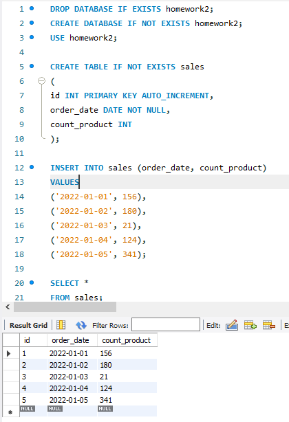
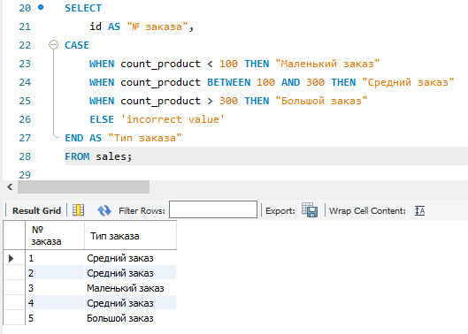
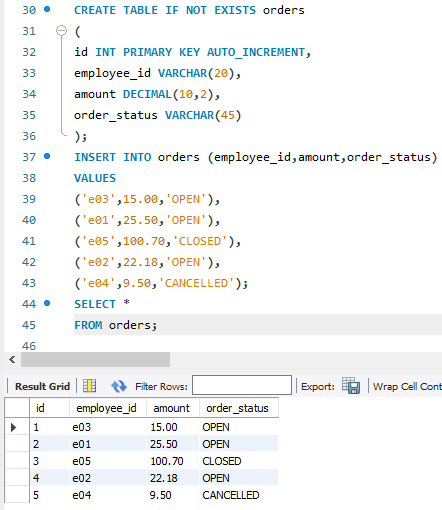
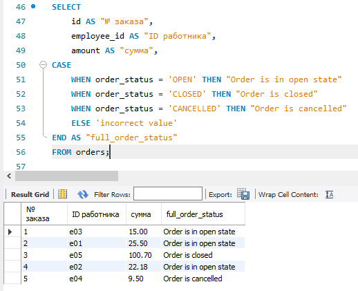
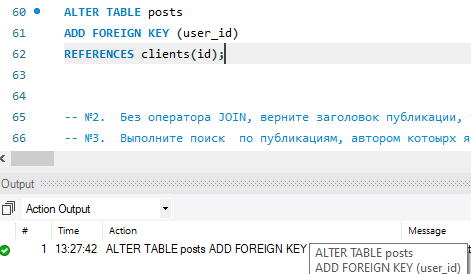
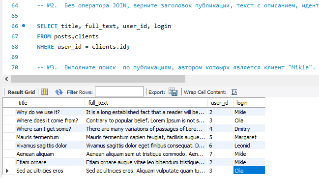
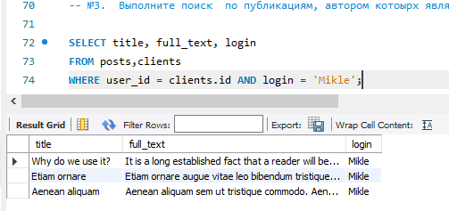

# Домашнее задание №2

### 1. Используя операторы языка SQL, создайте таблицу “sales”. Заполните ее данными.

### 2. Для данных таблицы “sales” укажите тип заказа в зависимости от кол-ва : меньше 100  -    Маленький заказ от 100 до 300 - Средний заказ больше 300  -     Большой заказ

### 3. Создайте таблицу “orders”, заполните ее значениями

### Выберите все заказы. В зависимости от поля order_status выведите столбец full_order_status:OPEN – «Order is in open state» ; CLOSED - «Order is closed»; CANCELLED -  «Order is cancelled»

### Дополнительное задание к первым 2 урокам: CRUD - операции на любом ЯП. Коннект с БД через С#, к примеру  
Нечто подобное делали на Python:
[ссылка на гит](https://github.com/niger23/PythonLearn/tree/main/Seminars/Seminar008)
### Файл со скриптом прикреплен к материалам(interview.sql):
### №1. Используя оператор ALTER TABLE, установите внешний ключ в одной из таблиц.

### №2. Без оператора JOIN, верните заголовок публикации, текст с описанием, идентификатор клиента, опубликовавшего публикацию и логин данного клиента.

### №3. Выполните поиск по публикациям, автором котоырх является клиент "Mikle".
