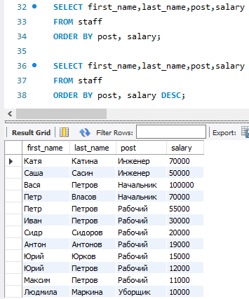
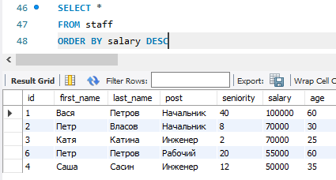
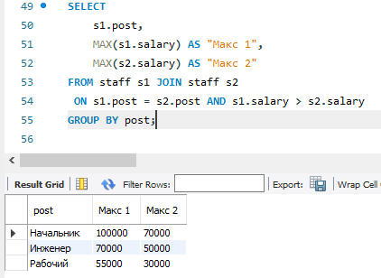
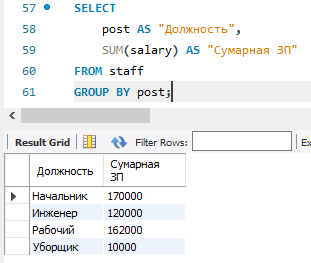
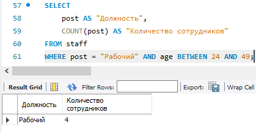
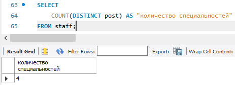
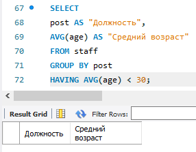
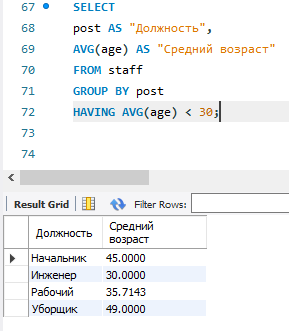

# Домашнее задание №3

### 1. Отсортируйте данные по полю заработная плата (salary) в порядке: убывания; возрастания для каждой группы

### 2. Выведите 5 максимальных заработных плат (saraly)

### 2.1 максимальную и предмаксимальную

### 3. Посчитайте суммарную зарплату (salary) по каждой специальности (роst)

### 4. Найдите кол-во сотрудников с специальностью (post) «Рабочий» в возрасте от 24 до 49 лет включительно.

### 5. Найдите количество специальностей

### 6. Выведите специальности, у которых средний возраст сотрудников меньше 30 лет

> нет ничего, потому что:

