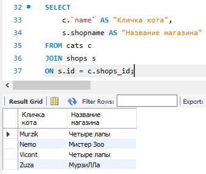
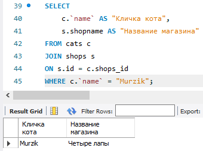
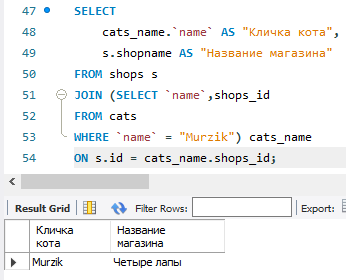
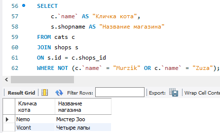
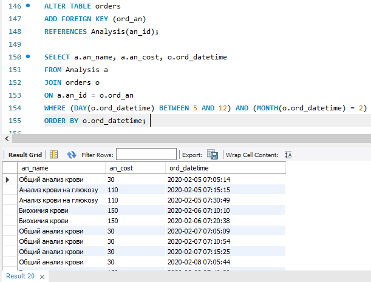
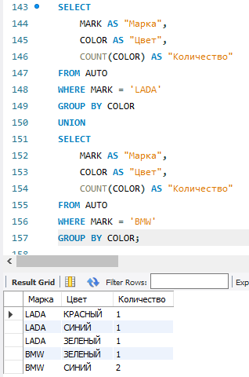
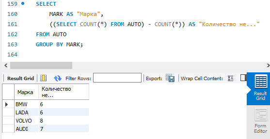
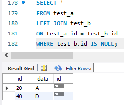

# Домашнее задание №3

### 1. Вывести всех котиков по магазинам по id (условие соединения shops.id = cats.shops_id)

### 2. Вывести магазин, в котором продается кот “Мурзик” (попробуйте выполнить 2 способами)

### 2.1 второй способ:

### 3. Вывести магазины, в которых НЕ продаются коты “Мурзик” и “Zuza”

### 4. Вывести название и цену для всех анализов, которые продавались 5 февраля 2020 и всю следующую неделю.

### 5. Вывести на экран сколько машин каждого цвета для машин марок BMW и LADA

### 6. Вывести на экран марку авто и количество AUTO не этой марки

### 7. Напишите запрос, который вернет строки из таблицы test_a, id которых нет в таблице test_b, НЕ используя ключевого слова NOT.

