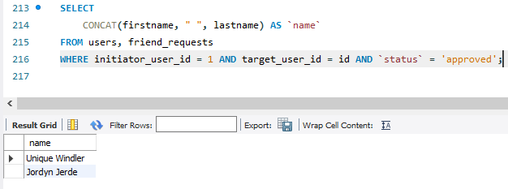

# Домашнее задание №5

### 1. Создайте представление, в которое попадут автомобили стоимостью  до 25 000 долларов

### 2. Изменить в существующем представлении порог для стоимости: пусть цена будет до 30 000 долларов (используя оператор ALTER VIEW) 

### 3. Изменить в существующем представлении порог для стоимости: пусть цена будет до 30 000 долларов (используя оператор ALTER VIEW) 

### 4. Добавьте новый столбец под названием «время до следующей станции». Чтобы получить это значение, мы вычитаем время станций для пар смежных станций.

### 5. Для скрипта, поставленного в прошлом уроке.Получите друзей пользователя с id=1

### 6. (решение задачи с помощью представления “друзья”)

### 7.  Создайте представление, в котором будут выводится все сообщения, в которых принимал участие пользователь с id = 1.

### 8.  Получите список медиафайлов пользователя с количеством лайков(media m, likes l ,users u)

### 9.  Получите количество групп у пользователей

### 10.  Вывести 3 пользователей с наибольшим количеством лайков за медиафайлы

