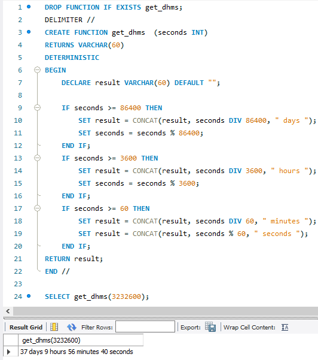
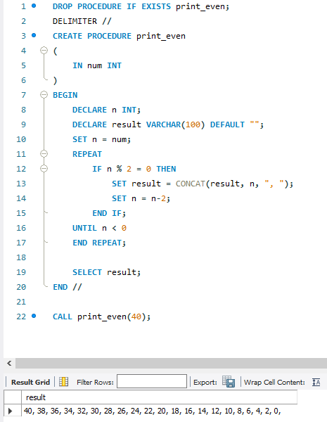
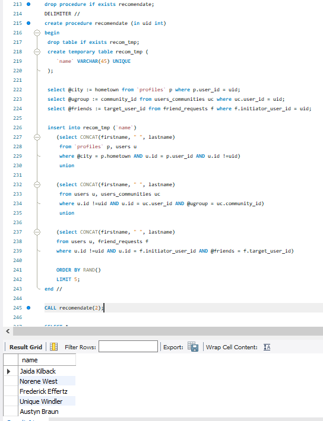
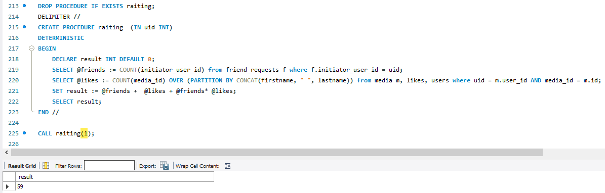

# Домашнее задание №6

### 1. Создайте функцию, которая принимает кол-во сек и форматирует их в кол-во дней, часов, минут и секунд.
> Пример: 123456 ->'1 days 10 hours 17 minutes 36 seconds '

### 2. Выведите только четные числа от 1 до 10 включительно. (Через функцию / процедуру)
> Пример: 2,4,6,8,10 (можно сделать через шаг +  2: х = 2, х+=2)

### 3. Создать процедуру, которая решает следующую задачу
Выбрать для одного пользователя 5 пользователей в случайной комбинации, которые удовлетворяют хотя бы одному критерию:
а) из одного города
б) состоят в одной группе
в) друзья друзей

### 4. Создать функцию, вычисляющей коэффициент популярности пользователя

